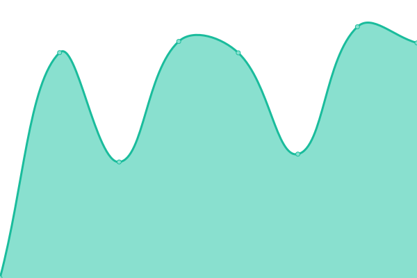
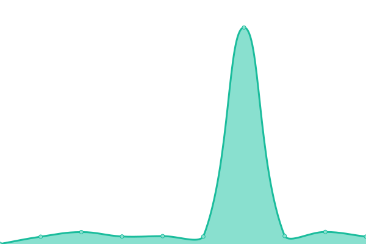
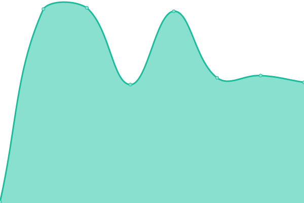
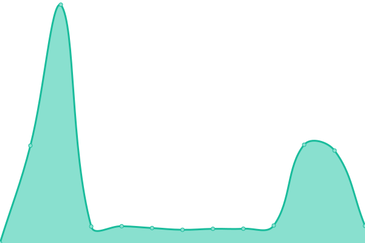
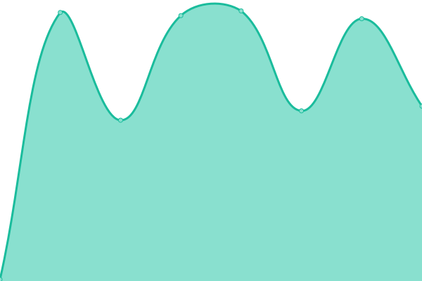

# [📈 Live Status](https://GESISWTS.github.io/uptime): <!--live status--> **🟩 All systems operational**

With [Upptime](https://upptime.js.org), you can get your own unlimited and free uptime monitor and status page, powered entirely by a GitHub repository. We use [Issues](https://github.com/MridulS/test_status_page/issues) as incident reports, [Actions](https://github.com/MridulS/test_status_page/actions) as uptime monitors, and [Pages](https://MridulS.github.io/test_status_page) for the status page.

<!--start: status pages-->
<!-- This summary is generated by Upptime (https://github.com/upptime/upptime) -->
<!-- Do not edit this manually, your changes will be overwritten -->
<!-- prettier-ignore -->
| URL | Status | History | Response Time | Uptime |
| --- | ------ | ------- | ------------- | ------ |
|  [ZIS](https://zis.gesis.org) | 🟩 Up | [zis.yml](https://github.com/GESISWTS/uptime/commits/master/history/zis.yml) | 

 1546ms
     
 | 

<a href="https://GESISWTS.github.io/uptime/history/zis">100.00%</a>
    

|  [x-science](https://www.x-science.org/xscience/#!Home) | 🟩 Up | [x-science.yml](https://github.com/GESISWTS/uptime/commits/master/history/x-science.yml) | 

 560ms
     
 | 

<a href="https://GESISWTS.github.io/uptime/history/x-science">100.00%</a>
    

|  [x-econ.org](https://x-econ.org/xecon/#!Home) | 🟩 Up | [x-econ-org.yml](https://github.com/GESISWTS/uptime/commits/master/history/x-econ-org.yml) | 

 587ms
     
 | 

<a href="https://GESISWTS.github.io/uptime/history/x-econ-org">100.00%</a>
    

|  [GESIS Login](https://login.gesis.org) | 🟩 Up | [gesis-login.yml](https://github.com/GESISWTS/uptime/commits/master/history/gesis-login.yml) | 

 959ms
     
 | 

<a href="https://GESISWTS.github.io/uptime/history/gesis-login">100.00%</a>
    

|  [Data Sharing](https://data.gesis.org/sharing/#!Home) | 🟩 Up | [data-sharing.yml](https://github.com/GESISWTS/uptime/commits/master/history/data-sharing.yml) | 

 751ms
     
 | 

<a href="https://GESISWTS.github.io/uptime/history/data-sharing">100.00%</a>
    

|  [qeditor - app](https://multiweb.gesis.org/labs/apps/qeditor) | 🟩 Up | [qeditor-app.yml](https://github.com/GESISWTS/uptime/commits/master/history/qeditor-app.yml) | 

 701ms
     
 | 

<a href="https://GESISWTS.github.io/uptime/history/qeditor-app">100.00%</a>
    

|  [qeditor](https://multiweb.gesis.org/qeditor) | 🟩 Up | [qeditor.yml](https://github.com/GESISWTS/uptime/commits/master/history/qeditor.yml) | 

 302ms
     
 | 

<a href="https://GESISWTS.github.io/uptime/history/qeditor">100.00%</a>
    

|  [GESIS Missy](https://www.gesis.org/missy) | 🟩 Up | [gesis-missy.yml](https://github.com/GESISWTS/uptime/commits/master/history/gesis-missy.yml) | 

 823ms
     
 | 

<a href="https://GESISWTS.github.io/uptime/history/gesis-missy">100.00%</a>
    

|  [leibnizopen](http://www.leibnizopen.de/suche/handle/document/113707) | 🟩 Up | [leibnizopen.yml](https://github.com/GESISWTS/uptime/commits/master/history/leibnizopen.yml) | 

 826ms
     
 | 

<a href="https://GESISWTS.github.io/uptime/history/leibnizopen">100.00%</a>
    

|  [DA-RA](https://www.da-ra.de/dara/mydara) | 🟩 Up | [da-ra.yml](https://github.com/GESISWTS/uptime/commits/master/history/da-ra.yml) | 

 2482ms
     
 | 

<a href="https://GESISWTS.github.io/uptime/history/da-ra">100.00%</a>
    

|  [vocabularies](https://vocabularies.cessda.eu) | 🟩 Up | [vocabularies.yml](https://github.com/GESISWTS/uptime/commits/master/history/vocabularies.yml) | 

 496ms
     
 | 

<a href="https://GESISWTS.github.io/uptime/history/vocabularies">100.00%</a>
    

|  [GESIS Notebooks](https://notebooks.gesis.org) | 🟩 Up | [gesis-notebooks.yml](https://github.com/GESISWTS/uptime/commits/master/history/gesis-notebooks.yml) | 

 842ms
     
 | 

<a href="https://GESISWTS.github.io/uptime/history/gesis-notebooks">100.00%</a>
    

|  [GESIS Notebooks - BinderHub](https://notebooks.gesis.org/binder) | 🟩 Up | [gesis-notebooks-binder-hub.yml](https://github.com/GESISWTS/uptime/commits/master/history/gesis-notebooks-binder-hub.yml) | 

 393ms
     
 | 

<a href="https://GESISWTS.github.io/uptime/history/gesis-notebooks-binder-hub">100.00%</a>
    

|  [GESIS Notebooks - Gallery](https://notebooks.gesis.org/gallery/) | 🟩 Up | [gesis-notebooks-gallery.yml](https://github.com/GESISWTS/uptime/commits/master/history/gesis-notebooks-gallery.yml) | 

 2333ms
     
 | 

<a href="https://GESISWTS.github.io/uptime/history/gesis-notebooks-gallery">100.00%</a>
    

|  [Persistent BinderHub - Health](https://notebooks.gesis.org/services/binder/health) | 🟩 Up | [persistent-binder-hub-health.yml](https://github.com/GESISWTS/uptime/commits/master/history/persistent-binder-hub-health.yml) | 

 1548ms
     
 | 

<a href="https://GESISWTS.github.io/uptime/history/persistent-binder-hub-health">100.00%</a>
    

|  [Persistent BinderHub - Docker](https://notebooks.gesis.org/services/binder/health) | 🟩 Up | [persistent-binder-hub-docker.yml](https://github.com/GESISWTS/uptime/commits/master/history/persistent-binder-hub-docker.yml) | 

 213ms
     
 | 

<a href="https://GESISWTS.github.io/uptime/history/persistent-binder-hub-docker">100.00%</a>
    

|  [Persistent BinderHub - Hub API](https://notebooks.gesis.org/services/binder/health) | 🟩 Up | [persistent-binder-hub-hub-api.yml](https://github.com/GESISWTS/uptime/commits/master/history/persistent-binder-hub-hub-api.yml) | 

 153ms
     
 | 

<a href="https://GESISWTS.github.io/uptime/history/persistent-binder-hub-hub-api">100.00%</a>
    

|  [BinderHub - Health](https://notebooks.gesis.org/binder/health) | 🟩 Up | [binder-hub-health.yml](https://github.com/GESISWTS/uptime/commits/master/history/binder-hub-health.yml) | 

 966ms
     
 | 

<a href="https://GESISWTS.github.io/uptime/history/binder-hub-health">98.50%</a>
    

|  [BinderHub - Docker](https://notebooks.gesis.org/binder/health) | 🟩 Up | [binder-hub-docker.yml](https://github.com/GESISWTS/uptime/commits/master/history/binder-hub-docker.yml) | 

 154ms
     
 | 

<a href="https://GESISWTS.github.io/uptime/history/binder-hub-docker">98.50%</a>
    

|  [BinderHub - Hub API](https://notebooks.gesis.org/binder/health) | 🟩 Up | [binder-hub-hub-api.yml](https://github.com/GESISWTS/uptime/commits/master/history/binder-hub-hub-api.yml) | 

 246ms
     
 | 

<a href="https://GESISWTS.github.io/uptime/history/binder-hub-hub-api">98.50%</a>
    

<!--end: status pages-->

[**Visit our status website →**](https://MridulS.github.io/test_status_page)

## 📄 License

- Powered by: [Upptime](https://github.com/upptime/upptime)
- Code: [MIT](./LICENSE) © [Mridul Seth](mriduls.github.io)
- Data in the `./history` directory: [Open Database License](https://opendatacommons.org/licenses/odbl/1-0/)
