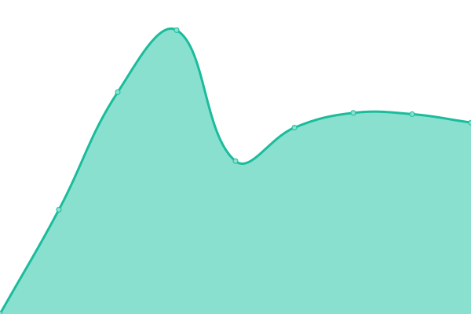

# [📈 Live Status](https://GESISWTS.github.io/uptime): <!--live status--> **🟧 Partial outage**

With [Upptime](https://upptime.js.org), you can get your own unlimited and free uptime monitor and status page, powered entirely by a GitHub repository. We use [Issues](https://github.com/MridulS/test_status_page/issues) as incident reports, [Actions](https://github.com/MridulS/test_status_page/actions) as uptime monitors, and [Pages](https://MridulS.github.io/test_status_page) for the status page.

<!--start: status pages-->
<!-- This summary is generated by Upptime (https://github.com/upptime/upptime) -->
<!-- Do not edit this manually, your changes will be overwritten -->
<!-- prettier-ignore -->
| URL | Status | History | Response Time | Uptime |
| --- | ------ | ------- | ------------- | ------ |
|  [GitLab](https://git.gesis.org) | 🟩 Up | [git-lab.yml](https://github.com/GESISWTS/uptime/commits/HEAD/history/git-lab.yml) | 

 756ms
     
 | 

<a href="https://GESISWTS.github.io/uptime/history/git-lab">99.81%</a>
    

|  [ZIS](https://zis.gesis.org) | 🟩 Up | [zis.yml](https://github.com/GESISWTS/uptime/commits/HEAD/history/zis.yml) | 

 1437ms
     
 | 

<a href="https://GESISWTS.github.io/uptime/history/zis">100.00%</a>
    

|  [x-science](https://www.x-science.org/xscience/#!Home) | 🟥 Down | [x-science.yml](https://github.com/GESISWTS/uptime/commits/HEAD/history/x-science.yml) | 

 0ms
     
 | 

<a href="https://GESISWTS.github.io/uptime/history/x-science">0.00%</a>
    

|  [x-econ.org](https://x-econ.org/xecon/#!Home) | 🟩 Up | [x-econ-org.yml](https://github.com/GESISWTS/uptime/commits/HEAD/history/x-econ-org.yml) | 

 502ms
     
 | 

<a href="https://GESISWTS.github.io/uptime/history/x-econ-org">100.00%</a>
    

|  [GESIS Login](https://login.gesis.org) | 🟩 Up | [gesis-login.yml](https://github.com/GESISWTS/uptime/commits/HEAD/history/gesis-login.yml) | 

 817ms
     
 | 

<a href="https://GESISWTS.github.io/uptime/history/gesis-login">100.00%</a>
    

|  [Data Sharing](https://data.gesis.org/sharing/#!Home) | 🟩 Up | [data-sharing.yml](https://github.com/GESISWTS/uptime/commits/HEAD/history/data-sharing.yml) | 

 462ms
     
 | 

<a href="https://GESISWTS.github.io/uptime/history/data-sharing">100.00%</a>
    

|  [qeditor - app](https://multiweb.gesis.org/labs/apps/qeditor) | 🟩 Up | [qeditor-app.yml](https://github.com/GESISWTS/uptime/commits/HEAD/history/qeditor-app.yml) | 

 547ms
     
 | 

<a href="https://GESISWTS.github.io/uptime/history/qeditor-app">100.00%</a>
    

|  [qeditor](https://multiweb.gesis.org/qeditor) | 🟩 Up | [qeditor.yml](https://github.com/GESISWTS/uptime/commits/HEAD/history/qeditor.yml) | 

 263ms
     
 | 

<a href="https://GESISWTS.github.io/uptime/history/qeditor">100.00%</a>
    

|  [GESIS Missy](https://www.gesis.org/missy) | 🟩 Up | [gesis-missy.yml](https://github.com/GESISWTS/uptime/commits/HEAD/history/gesis-missy.yml) | 

 728ms
     
 | 

<a href="https://GESISWTS.github.io/uptime/history/gesis-missy">99.69%</a>
    

|  [leibnizopen](http://www.leibnizopen.de/suche/handle/document/113707) | 🟥 Down | [leibnizopen.yml](https://github.com/GESISWTS/uptime/commits/HEAD/history/leibnizopen.yml) | 

 0ms
     
 | 

<a href="https://GESISWTS.github.io/uptime/history/leibnizopen">0.00%</a>
    

|  [DA-RA](https://www.da-ra.de/dara/mydara) | 🟩 Up | [da-ra.yml](https://github.com/GESISWTS/uptime/commits/HEAD/history/da-ra.yml) | 

 917ms
     
 | 

<a href="https://GESISWTS.github.io/uptime/history/da-ra">100.00%</a>
    

|  [vocabularies](https://vocabularies.cessda.eu) | 🟩 Up | [vocabularies.yml](https://github.com/GESISWTS/uptime/commits/HEAD/history/vocabularies.yml) | 

 504ms
     
 | 

<a href="https://GESISWTS.github.io/uptime/history/vocabularies">100.00%</a>
    

|  [GESIS Notebooks](https://notebooks.gesis.org) | 🟩 Up | [gesis-notebooks.yml](https://github.com/GESISWTS/uptime/commits/HEAD/history/gesis-notebooks.yml) | 

 687ms
     
 | 

<a href="https://GESISWTS.github.io/uptime/history/gesis-notebooks">100.00%</a>
    

<!--end: status pages-->

[**Visit our status website →**](https://gesiswts.github.io/uptime)

## 📄 License

- Powered by: [Upptime](https://github.com/upptime/upptime)
- Code: [MIT](./LICENSE) © [Mridul Seth](mriduls.github.io)
- Data in the `./history` directory: [Open Database License](https://opendatacommons.org/licenses/odbl/1-0/)
